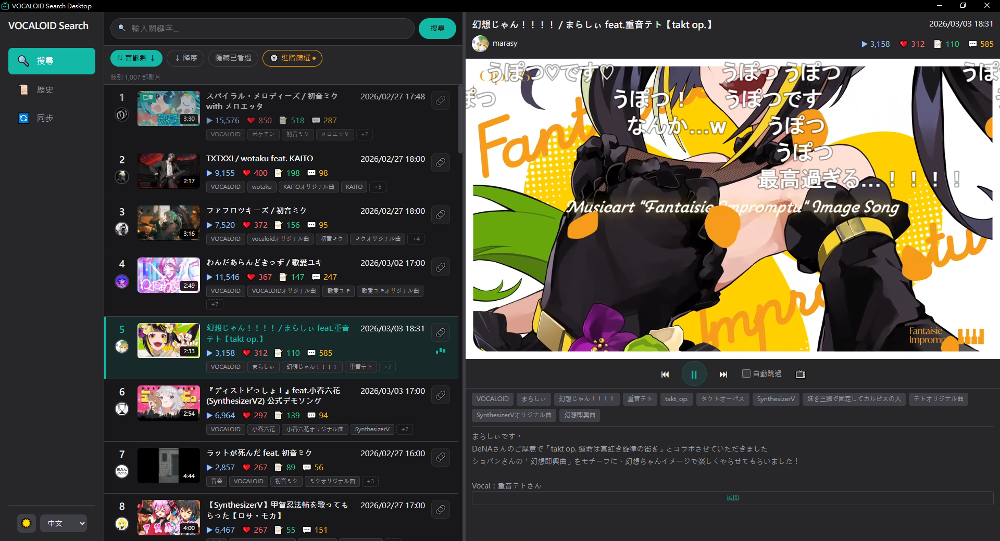
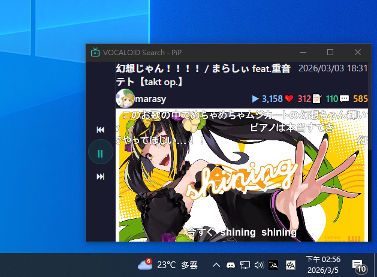

# VOCALOID Search Desktop

一款本地優先的桌面應用程式，用於搜尋 Niconico VOCALOID 影片，擁有現代化的 Spotify 風格介面。

> **靈感來自 [ニコニコ超検索](https://gokulin.info/search/)** – 一個熱門的 Niconico 影片搜尋服務。

這是 [網頁版 VOCALOID Search](https://github.com/anton1615/VOCALOID-Search) 的桌面移植版，使用 Tauri 重新打造為本地優先的應用程式。

> **註**：本專案完全以 **vibe coding** 方式開發 – 透過 AI 輔助的迭代開發過程構建。

**[English](./README.md) | [日本語](./README.ja.md)**

---

## 截圖




---

## 功能

- **現代化介面**：Spotify 風格 UI，播放清單式版面配置
- **亮色/暗色模式**：主題切換
- **多語言支援**：英文、日文、繁體中文
- **PiP 視窗**：彈出子母畫面播放器，保持在最上層
- **觀看紀錄**：追蹤已觀看的影片
- **排除已觀看**：從搜尋結果中排除已看過的影片
- **視窗狀態保存**：跨 session 記憶視窗位置、大小、最大化狀態
- **本地資料庫**：將影片資料下載至本地，支援離線快速搜尋
- **自訂公式排序與篩選**：以自訂權重排序觀看數、喜歡數、收藏數、留言數
- **自動跳過**：自動跳過影片結尾（適合跳過片尾名單或置入性行銷）
- **嵌入式播放器**：使用官方 Niconico 嵌入播放器連續播放
- **關鍵字 + 標籤搜尋**：支援標籤篩選的全文搜尋
- **無限滾動**：動態載入取代傳統分頁

---

## 網頁版與桌面版比較

| 功能 | 網頁版 | 桌面版 |
|------|--------|--------|
| **部署方式** | 自架伺服器 (NixOS/Linux) | 本地應用程式 (Windows) |
| **運行模式** | 24 小時伺服器運作 | 按需啟動 |
| **爬蟲** | 透過 systemd timer 自動執行 | 手動執行 |
| **多使用者** | 支援（可註冊帳號） | 單一使用者，本地資料 |
| **手機支援** | PWA/TWA 支援 Android | 不適用 |
| **PiP 模式** | 視窗縮小為精簡模式 | 原生置頂視窗 |
| **資料儲存** | 伺服器端資料庫 | 本地檔案系統 |
| **離線搜尋** | 需連接伺服器 | 完全本地 |
| **平台** | 僅限 NixOS/Linux | Windows（Linux 支援計劃中） |

### 該選擇哪個版本？

**適合網頁版的情況：**
- 需要 24 小時自動爬取資料
- 需要多使用者支援
- 希望透過 PWA 在手機使用
- 有 NixOS/Linux 伺服器

**適合桌面版的情況：**
- 偏好原生桌面體驗
- 需要與 OS 緊密結合的 PiP 視窗
- 不想管理伺服器
- 需要完全離線搜尋功能

---

## 技術規格

| 層級 | 技術 |
|------|------|
| **前端** | TypeScript, Vue 3, Vite, Tailwind CSS |
| **後端** | Rust (Tauri 2.x) |
| **資料庫** | SQLite (FTS5 全文搜尋) |
| **資料來源** | [Niconico Snapshot API v2](https://site.nicovideo.jp/search-api-docs/snapshot.html), [GetThumbInfo API](https://site.nicovideo.jp/search-api-docs/thumb-info.html) |

### 實作架構

```
┌─────────────────────────────────────────┐
│           Vue 3 Frontend                │
│  (Search UI, Player, Settings, PiP)     │
└─────────────────┬───────────────────────┘
                  │ Tauri IPC
┌─────────────────▼───────────────────────┐
│           Rust Backend                   │
│  (SQLite, HTTP Client, File System)     │
└─────────────────┬───────────────────────┘
                  │
┌─────────────────▼───────────────────────┐
│    Local SQLite Database (FTS5)         │
└─────────────────────────────────────────┘
```

### 主要技術細節

- **自訂協定**：使用 Tauri 的自訂協定（`tauri://localhost`）而非 HTTP localhost，以避開 Niconico 嵌入播放器的網域限制
- **FTS5 全文搜尋**：SQLite FTS5 實現支援 AND/OR/NOT 運算子的快速關鍵字與標籤搜尋
- **公式化評分**：自訂權重的彈性排序系統

## 系統需求

- **作業系統**：Windows 10/11 (x64)
- **記憶體**：最低 4GB，建議 8GB
- **儲存空間**：執行檔約 10MB。資料庫大小取決於同步範圍（例如 VOCALOID 關鍵字、20 天、音樂分類 ≈ 40MB）。WebView2 Runtime 通常已預載於 Windows 10/11。
- **網路**：影片播放與資料同步需要網路連線

## 資料儲存位置

資料庫與設定儲存於：
```
Windows: %APPDATA%\com.vocaloid-search.desktop
```

### 便攜模式

若要使用便攜模式（將資料儲存於應用程式資料夾），請在執行檔同目錄建立 `data/` 資料夾：
```
<vocaloid-search-desktop.exe 所在目錄>/data/
```

便攜模式啟用後，所有資料（資料庫、設定、縮圖）都會儲存在此資料夾。您可以將整個資料夾複製到其他電腦使用相同的資料。

**注意**：便攜模式與標準模式之間的切換不會自動遷移資料。

---

## 使用說明

### 使用流程

1. **啟動檢查**：應用程式啟動時會自動檢查資料庫是否為空或過期。Niconico Snapshot API 每天約 JST 5-6 點更新。若資料庫過期，會提示您同步。

2. **同步資料庫**：進入「資料同步」頁面設定並執行爬蟲：
   - **查詢**：搜尋關鍵字（預設：`VOCALOID`）
   - **最大天數**：僅抓取最近 N 天的影片（預設：365，留空則不限制）
   - **搜尋目標**：在 `tags`、`tagsExact`、`title`、`description` 或組合如 `tags,title` 中搜尋
   - **分類**：分類篩選（預設：`MUSIC`）
   
   點擊「開始同步」下載影片資料。建議每天同步一次。

3. **搜尋與瀏覽**：使用搜尋列以關鍵字搜尋影片。加入標籤篩選縮小範圍。調整排序公式以優先顯示觀看數、喜歡數、收藏數或留言數。啟用「排除已觀看」可隱藏已看過的影片。

4. **觀看影片**：點擊影片在嵌入式播放器中播放。影片會從清單自動連續播放。在播放設定中啟用自動跳過可自動跳過影片結尾。

5. **PiP 模式**：點擊彈出按鈕開啟子母畫面視窗。PiP 視窗是簡化版的播放器，沒有導覽列，並保持在最上層。

### 爬蟲設定選項

| 選項 | 預設值 | 說明 |
|------|--------|------|
| `query` | `VOCALOID` | Niconico Snapshot API 搜尋關鍵字 |
| `max_age_days` | `365` | 僅抓取 N 天內的影片。留空則不限制 |
| `targets` | `tags` | 搜尋目標：`tags`、`tagsExact`、`title`、`description` 或組合 |
| `category_filter` | `MUSIC` | Niconico 分類篩選（MUSIC, GAME, ANIME, ENTERTAINMENT, DANCE, OTHER） |

---

## 從原始碼建置

### 前置需求

- Node.js 18+
- Rust 1.70+（含 `cargo`）
- Windows 10/11 SDK

### 建置步驟

```bash
# 複製儲存庫
git clone https://github.com/anton1615/VOCALOID-Search-Desktop.git
cd VOCALOID-Search-Desktop/vocaloid-search-desktop

# 安裝依賴
npm install
```

#### 開發版建置

```bash
npm run tauri dev
```

這會啟動前端開發伺服器和 Tauri 開發模式。

#### 正式版建置

```bash
# 同時建置前端和後端
npm run tauri build

# 或使用 debug 旗標建置（編譯較快，檔案較大）
npm run tauri build -- --debug
```

> **重要**：Tauri 使用自訂協定（`tauri://localhost`）而非 HTTP localhost 來處理嵌入播放器。這是因為 Niconico 的嵌入播放器會拒絕來自 `localhost` 網域的請求。
>
> **開發注意**：由於 Niconico 拒絕 localhost 連線，無法使用 `tauri dev` 測試嵌入式播放器。前端修改後必須重新編譯整個應用程式才能測試。使用 `--debug` 可以跳過 Rust 優化加快編譯速度，讓開發迭代更順暢。正式發布請使用無 `--debug` 的 release build。

建置完成的執行檔位置：
```
vocaloid-search-desktop/src-tauri/target/release/vocaloid-search-desktop.exe
```

---

## 已知問題與未來計劃

> ⚠️ **原型版本**：這是早期原型。功能可能不穩定，部分功能尚未完整測試。

### 已知問題

1. **歷史頁面**：顯示觀看紀錄但點擊影片無作用
2. **PiP ↔ 主視窗同步**：狀態同步不完整 ✅ v1.0.1 已修復
   - ~~PiP 中的播放不會記錄到觀看歷史~~ 現在 PiP 播放會正確記錄到觀看歷史
   - ~~開啟/關閉 PiP 時播放狀態會重置~~ v1.1.0 已修復
3. **PiP 視窗**：偶爾無法關閉（原因不明）
4. **PiP 播放清單載入**：當 PiP 到達已載入結果的結尾時，會等待主視窗載入更多（PiP 本身無法觸發載入更多） ✅ v1.1.0 已修復
5. **地區限制影片**：會中斷自動播放，因無法播放也無法標記為已觀看
6. **事件進行中切換分頁**：在事件進行中（如爬蟲同步、主視窗或 PiP 視窗播放影片）切換分頁可能導致不可預期的問題
   - ~~切回搜尋頁面時 UI 狀態不一致~~ v1.1.2 已修復 - SearchView 現在從 Rust 恢復狀態
   - PiP 視窗同步失敗（罕見，原因不明）
### 未來計劃

1. **內建「稍後觀看」**：實作類似 Niconico「あとで見る」的功能
2. **自訂播放清單**：使用者自訂影片收藏
3. **改善狀態同步**：主視窗與 PiP 間的同步優化
4. **快捷鍵控制**：加入全域快捷鍵控制播放元件（播放/暫停、上/下一首、音量等）
5. **以瀏覽器開啟**：與嵌入式播放器互動以用預設瀏覽器開啟連結，或在 PiP 視窗中加入按鈕快速以預設瀏覽器開啟當前影片的 Niconico 原始頁面
6. **全局音量控制**：加入應用程式層級的音量控制，獨立於嵌入式播放器之外
7. **資料庫容量顯示**：在同步頁面顯示目前資料庫的容量大小
8. **資料庫大小預估**：同步前根據搜尋條件預估資料庫大小，幫助使用者規劃儲存空間
9. **儲存空間檢查**：同步前檢查並警告使用者儲存空間是否不足
10. **可點擊標籤**：點擊標籤可直接加入搜尋框作為搜尋條件
11. **標題與作者連結**：嵌入式播放器上方的標題和作者名字加入超連結，可由預設瀏覽器開啟各自的 Niconico 原始頁面
12. **Linux 支援**：利用 Tauri 的跨平台能力開發原生 Linux 版本
13. **離線播放**：下載影片至本地，在無網路環境下也能觀看
---

## 授權

[MIT License](./LICENSE)

---

## 版本更新說明

### v1.4.0 - 同步前預估與儲存空間防護

**主要變更:**
- 新增每次執行 scraper 前都會出現的 preflight 同步確認流程
- 在清空本機資料庫前先顯示預估影片數、預估資料庫大小與可用磁碟空間
- 重整同步頁的資料庫狀態提示與儲存位置區塊，讓資訊更清楚易懂

**錯誤修復:**
- 修正 `max days = 0` 時應視為 unlimited，避免預估影片數異常接近零
- 將同步頁分類下拉選單補齊為 backend 支援的 Snapshot API 分類，並新增「無」選項
- 當預估資料庫大小超過可用磁碟空間時，隱藏確認按鈕並顯示醒目警告，避免硬碟空間不足時仍啟動同步

### v1.3.1 - WebView 安全基線與 PiP 播放修正

**主要變更:**
- 為 Tauri WebView 加入最小可行的 CSP baseline，不再維持 `csp: null`
- 在新 baseline 下保留開發啟動、封裝建置與 NicoNico 嵌入播放器的相容性
- 將 PiP 與主視窗的播放路徑對齊，讓兩個視窗的嵌入播放行為保持一致

**錯誤修復:**
- 修正 PiP 在重新 render 後可能留下未綁定來源 iframe 的回歸問題
- 修正 load-complete 之後若無法直接取得 iframe window，PiP 自動播放會失敗的問題
- 將 `shell:allow-open` 的 hardening 明確記錄為後續工作，同時避免擴大本次 release 範圍

### v1.3.0 - 播放設定改善

**主要變更:**
- 將主視窗原本常駐顯示的自動跳過勾選框改為由齒輪展開的播放設定面板
- 將自動播放與片尾自動跳過改為兩個獨立設定
- 設定面板展開/收合狀態不持久化，啟動時一律預設收起
- 自動播放與自動跳過的勾選值在重新啟動應用程式後也會恢復

**錯誤修復:**
- 修正切換到下一部影片後自動播放有時不會開始的問題
- 修正 cross-origin iframe 訊息目標不穩定，導致播放指令無法正確送出的問題
- 修正即使未啟用片尾自動跳過，影片播完仍會跳到下一首的問題
- 保留內部 skip threshold 邏輯，同時移除使用者可見的秒數輸入 UI

### v1.1.2 - 錯誤修復

**錯誤修復:**
- 修正播放中切換分頁時 UI 狀態不一致的問題 - SearchView 現在從 Rust AppState 恢復狀態，不會再重置
- 修正切換分頁時 PiP 狀態未恢復的問題 - `pipActive` 現在與 Rust AppState 同步
- 修正關閉主視窗時 PiP 視窗殘留的問題 - PiP 視窗現在會隨主視窗自動關閉

### v1.1.1 - 錯誤修復

**錯誤修復:**
- 修正資料庫新鮮度判斷邏輯 - 現在正確地將上次更新時間與最近的 6:00 JST 分界點比較（先前使用了錯誤的 24 小時視窗邏輯）

### v1.1.0 - 架構重構

**主要變更:**
- **Rust 統一狀態管理**: 所有應用程式狀態由 Rust AppState 管理，前端組件作為純顯示層
- **AppState 中的 SearchState**: 搜尋參數（查數（查詢、篩選、排序、頁、頁碼）儲存於 `AppState.search_state`，實現跨視窗一致存取
- **is_watched 同步**: 主視窗與 PiP 間的觀看狀態無需明確同步邏輯即可同步
- **任意視窗可觸發 loadMore**: PiP 到達結果結尾時可直接觸發 `loadMore()`，消除播放中斷

**錯誤修復:**
- 修正資料庫新鮮度判斷邏輯 - 正確與最近的 6:00 JST 分界點比較
- 修正 PiP 播放在結果邊界的斷層 - 在到達結尾前開始預載
- 新增連續播放時的自動滾動 - 保持當前播放影片下方有 2 部影片可見

### v1.0.2 - 錯誤修復

**錯誤修復:**
- 修正「排除已觀看」篩選器返回空結果的問題 - 將 SQL 表格參照從 `watched` 修正為 `history`

### v1.0.0 - 初始版本

VOCALOID Search Desktop 初始版本，核心功能:
- Spotify 風格現代化介面（亮色/暗色模式）
- 多語言支援（英文、日文、繁體中文）
- 子母畫面播放 PiP 視窗
- 觀看紀錄追蹤
- 排除已觀看篩選
- 視窗狀態保存
- FTS5 全文搜尋本地 SQLite 資料庫
- 自訂公式排序與篩選
- 自動跳過功能
- Niconico 嵌入式播放器連續播放
- 無限滾動分頁